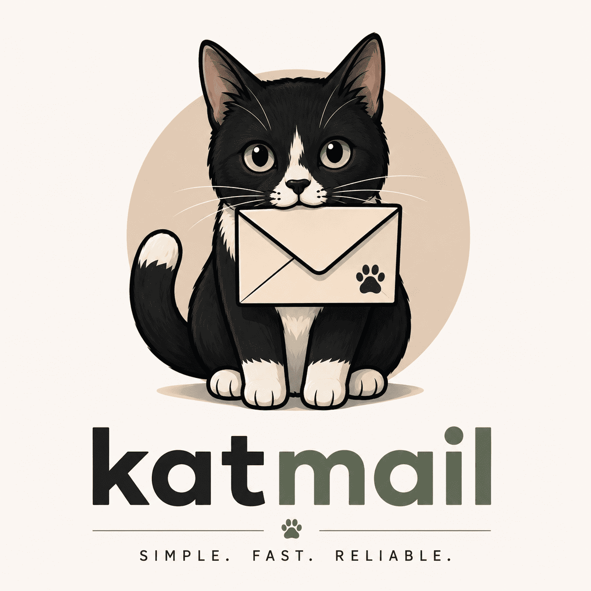

# Katmail


<div align="center">

</div>


Simple. Fast. Reliable.

A lightweight email relay service written in Go.


<!--  -->


---

## Overview

Katmail is a lightweight email relay service designed to receive messages from applications and forward them through an external email provider.

The project was initially created to power the contact form of my personal portfolio, but it is designed to be reusable across multiple projects.

---

## Features

- [ ] REST API endpoint
- [ ] JSON payload handling
- [ ] Environment-based configuration
- [ ] Request validation
- [ ] Email provider integration
- [ ] Contact form integration

---

## Current Status

Katmail is currently under active development.

The initial goal is to provide a simple and reusable email relay service for personal projects, starting with my portfolio contact form.

### Progress

- [x] Project initialization
- [ ] HTTP server setup
- [ ] Request validation
- [ ] Brevo integration
- [ ] Dockerization
- [ ] Production deployment

---

## Roadmap

### MVP

- [ ] Brevo integration
- [ ] Contact form integration
- [ ] Healthcheck endpoint
- [ ] Structured logging
- [ ] Email templates

### Security

- [ ] Rate limiting
- [ ] Honeypot protection
- [ ] CORS configuration

### Deployment

- [ ] Docker image publishing
- [ ] GitHub Actions pipeline
- [ ] GHCR integration
- [ ] Coolify deployment

### Future Improvements

- [ ] Multiple email providers
- [ ] Webhook support
- [ ] Metrics and monitoring
- [ ] Message persistence
- [ ] Admin dashboard

---

<!-- ## Architecture

```text
Client Application
        │
        ▼
     Katmail
        │
        ▼
 Email Provider
 (Brevo, ...)
        │
        ▼
 Recipient Inbox
```

Example:

```text
Portfolio
    │
    ▼
  Katmail
    │
    ▼
   Brevo
    │
    ▼
 Proton Mail
```

--- -->

## Tech Stack

| Technology | Purpose |
|------------|----------|
| Go | Backend API |
<!-- | Docker | Containerization | -->
| Brevo | Email delivery |
<!-- | GitHub Actions | CI/CD | -->
<!-- | GHCR | Container Registry | -->
<!-- | Coolify | Deployment | -->

<!-- --- -->

<!-- ## API

### Send Message

```http
POST /contact
```

Request:

```json
{
  "name": "John Doe",
  "email": "john@example.com",
  "subject": "Hello",
  "message": "This is a test message."
}
```

Response:

```json
{
  "success": true
}
```

---

## Running Locally

```bash
go run main.go
```

Server available at:

```text
http://localhost:8080
```

--- -->

<!-- ## Environment Variables -->

<!-- ```env
BREVO_API_KEY=
SENDER_EMAIL=
RECIPIENT_EMAIL=
``` -->

<!-- --- -->

## Why Katmail?

The name comes from two simple ideas:

- 🐈 Cats are the true rulers of the internet.
- ✉️ Katmail exists for one purpose: delivering messages reliably.

Inspired by my tuxedo cat, who somehow always manages to get attention exactly when needed.

<!-- --- -->

<!-- ## License

MIT -->